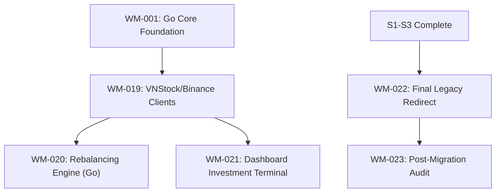

# Sprint 4: Market Alpha & Migration

**Slogan**: _"Activating High-Alpha Market Data in the New Core"_  
**Period**: May 13th - May 26th  
**PO/PM**: Antigravity  
**Dev Lead**: Antigravity

---

## 🏗️ Sprint 4: Dependency Visualization

---

## 🟠 Sprint 4: Definition of Done (DoD)

1.  **Market Engine**: Successful integration of the Go backend with the `vnstock-server` (Python) and external market APIs (Binance).
2.  **Investment Alpha**: Ticker deep-dive (M-T-F Confluence) and Rebalancing Suggestions are fully functional in Go and Svelte.
3.  **Migration Final**: All user sessions and configurations are migrated to the new Go-Svelte platform.
4.  **Legacy Deprecation**: Officially decommissioned.
5.  **MCP Tools**: Market telemetry and portfolio analysis exposed as **MCP Tools** (e.g., `get_market_spot`, `calculate_asset_drift`).

---

## 🧩 Domain Naming Reference

- Source of truth: [\_technical/1-Data-Engine/Architecture_and_Schema.md](file:///Users/ez2/projects/personal/monorepo/docs/wealth-management/_technical/1-Data-Engine/Architecture_and_Schema.md) section **2.0 Domain Modeling & Naming Convention (Go Engine)**.
- Sprint-wide conventions: [tasks/README.md](file:///Users/ez2/projects/personal/monorepo/docs/wealth-management/tasks/README.md) section **5. Standing Conventions (Permanent)**.

---

## Task Files

- [WM-019](./WM-019.md)
- [WM-020](./WM-020.md)
- [WM-021](./WM-021.md)
- [WM-022](./WM-022.md)
- [WM-023](./WM-023.md)
